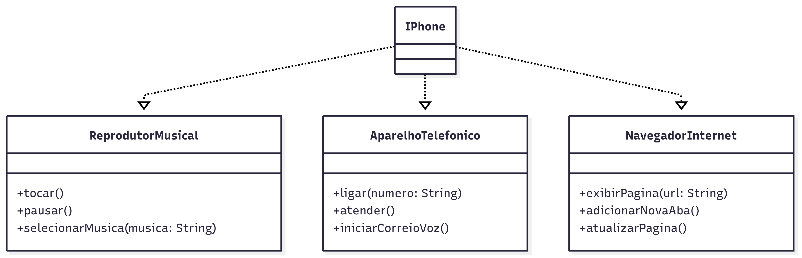

## Desafio - Trilha Básica Java
Este repositório trata-se do desafio de código do bootcamp Santander na DIO proposto por Gleyson Sampaio cujo objetivo é modelar e diagramar a representação UML do componente iPhone, abrangendo suas funcionalidades como Reprodutor Musical, Aparelho Telefônico e Navegador na Internet.

## Contexto
Com base no vídeo de lançamento do iPhone de 2007, o desafio era elaborar a diagramação das classes e interfaces utilizando uma ferramenta UML de sua preferência. Em seguida, implemente as classes e interfaces no formato de arquivos .java.

## Meu Código
Diagrama de classes utilizando o Mermaid para modelar as funcionalidades do iPhone apresentadas no lançamento em 2007.

## Códigos em Java das interfaces
O código em Java das interfaces do iPhone estão disponibilizadas na pasta src.
